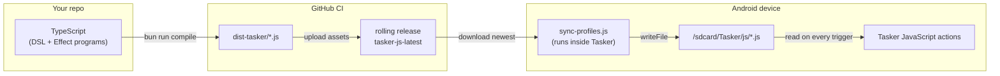
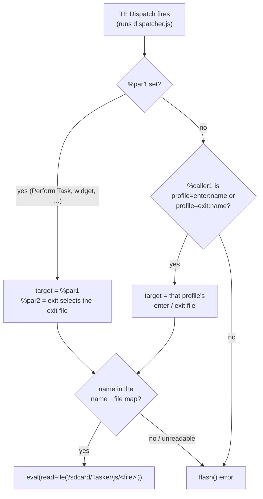

# tasker-effect

Write [Tasker](https://tasker.joaoapps.com/) (Android automation) tasks in
TypeScript with [Effect](https://effect.website/), and compile them to plain
JavaScript that Tasker executes directly.

**The approach:** Tasker can run JavaScript natively via its JavaScript /
JavaScriptlet actions. So there is no XML to generate — you write TypeScript,
CI compiles it to JS, and your device pulls the latest build and runs it.



## Modules

| Module | Purpose |
| --- | --- |
| `tasker-api` | Type-safe Effect bindings for every documented Tasker JS function (~110), plus a typed `raw` escape hatch |
| `profile` | Schema-validated DSL: tasks are sequences of tagged actions, profiles add trigger metadata |
| `compiler` | Compiles DSL definitions to standalone JS using only Tasker globals (no runtime deps), plus a dispatcher, a `secrets.json` manifest and an import-once project XML |
| `runtime` | `runInTasker` for Effect programs bundled to a single file |
| `config` | Tasker-backed `ConfigProvider`: scripts read secrets/config via `Config`, with lazy on-device prompting |
| `sync/core` + `sync/contract` | Platform-free sync program (`ProfileSync`) and its error/capability contract — exported from the package root |
| `sync/node` | Desktop layers (`tasker-effect/sync/node` entry point; @effect/platform-node) |
| `sync/tasker` | On-device layers (`tasker-effect/sync/tasker` entry point; Tasker builtins) |

## Quick start

```bash
bun install
bun run typecheck   # type check (Effect-aware: tsc is patched by @effect/tsgo)
bun run lint        # oxlint, including type-aware Effect language service rules
bun run test        # run tests (vitest + @effect/vitest)
bun run compile     # compile tasks/ to dist-tasker/
```

### Declarative DSL

```typescript
import { Action, Trigger, Task, Profile, cond } from "tasker-effect";

const lowBattery = new Profile({
  name: "Low Battery Saver",
  triggers: [Trigger.batteryLevel(0, 20)],
  enter: new Task({
    name: "Battery Saver On",
    actions: [
      Action.flash("Battery low — saving power"),
      Action.setWifi(false),
      Action.when(cond("%LOCATION", "eq", "home"), [
        Action.say("Charge me, please"),
      ]),
    ],
  }),
});
```

`bun run compile` turns each task into a plain JS file plus a README that
documents which triggers to configure in the Tasker UI. Everything is
validated at construction time by Effect Schema — invalid hours, empty
messages or malformed vibration patterns fail before anything reaches the
device.

### Typed task references

Calling another DSL task takes the `Task` *object*, not a string — typos
become type errors, and renames propagate automatically:

```typescript
const weatherCheck = new Task({ name: "Weather Check", actions: [/* … */] });

const morningEnter = new Task({
  name: "Morning Enter",
  actions: [
    Action.flash("Good morning!"),
    Action.performTask(weatherCheck),        // typed reference
    Action.enableProfile(nightMode, false),  // same for profiles
  ],
});
```

The action itself stays flat and serializable — only the task's name is
stored. At compile time `Action.performTask` routes through the shared
dispatcher: it emits `performTask("TE Dispatch", <priority>, "<name>",
undefined)`, so the call resolves against the dispatcher's name→file map.
Because the dispatcher consumes `%par1` (target name) and `%par2` (exit
switch) for its own resolution, this variant takes no custom parameters —
only `priority`.

**Escape hatch for UI-created tasks:** tasks and profiles that only exist
on the phone (hand-built in the Tasker UI) are referenced by name and
compile to a direct call, parameters included:

```typescript
Action.performTaskerTask("Hand Made Task", { parameterOne: "now" });
Action.enableTaskerProfile("Hand Made Profile", false);
```

These are not validated — the compiler cannot see what exists on-device.

**Linker check:** compiling a `Project` fails with a `CompileError` if any
DSL `performTask` references a task that is not in `project.tasks`, naming
the offending profile/task and listing the valid targets. Standalone
task/profile compilation has no project context, so the check only runs at
the project level.

### CLI

Repos that depend on `tasker-effect` can compile their DSL definitions
without writing any build script:

```bash
bunx tasker-effect compile                       # tasks/automations.ts → dist-tasker/
bunx tasker-effect compile my/entry.ts --out build
```

The CLI imports the entry module and compiles every export (default and
named) that is a `Project`, `Profile` or `Task` into Tasker-ready JS files,
plus a setup README per project. TypeScript entries require Bun (`bunx`);
plain JavaScript entries also work under Node (`npx tasker-effect`).

The CLI is DSL codegen only — bundling Effect programs for Tasker is
intentionally left to the consumer, e.g.:

```bash
esbuild script.ts --bundle --minify --format=iife --platform=browser --outfile=dist-tasker/script.js
```

### The dispatcher: import once, then only triggers

Compiling a `Project` also emits extra files:

- **`tasker-effect.prj.xml`** — static scaffolding as an importable Tasker
  *project*: the shared **TE Dispatch** task (a file-based *JavaScript*
  action, Auto Exit on, pointing at `/sdcard/Tasker/js/dispatcher.js`), the
  self-bootstrapping **TE Sync** task with a periodic **TE Sync** profile
  (every 6 hours), and the **TE Config** secrets prompter. It never embeds
  compiled logic, so you import it exactly once: Tasker → long-press the
  home icon (bottom left) → *Import Project*.
- **`dispatcher.js`** — generated from your project: it embeds a map of
  profile/task names to compiled files and runs the right one with
  `eval(readFile(...))`.
- **`secrets.json`** — every secret used inline in your tasks (name +
  description), aggregated by the compiler; `TE Config` prompts for the
  unset ones on-device.

How the dispatcher picks the file:

1. **Explicit `%par1`** (a profile or task name) wins; `%par2` = `exit`
   selects a profile's exit file. Use this from Perform Task, widgets, etc.
2. Otherwise it reads Tasker's **`%caller1`**, which for profile-launched
   tasks is `profile=enter:<name>` or `profile=exit:<name>` — so a new
   profile only needs its trigger plus `TE Dispatch` as both its enter and
   its exit task. No per-task file paths, no per-task UI work.



Unknown names or unreadable files `flash()` a clear error. The JS directory
defaults to `/sdcard/Tasker/js/` and can be overridden with the Tasker
global `%TE_JS_DIR` (also edit the path inside the imported task if you do).

Because `dispatcher.js` is a regular `.js` release asset it updates through
the normal sync, keeping the name→file map current. The `.prj.xml` is *not*
synced (sync pulls only `.js` and `.json` on purpose): download it manually
once from the latest release — it only ever contains static scaffolding
(the dispatcher pointer and your repo's slug for the sync bootstrap), so it
never goes stale.

The repo embedded in the XML's sync bootstrap is detected from
`git remote get-url origin`; override it with
`bunx tasker-effect compile --repo owner/name`.

### Secrets and interpolation

Declare a secret once, then use it **inline** anywhere a string value or a
variable name goes — the compiler detects every use site by walking the
action tree and aggregates them into `secrets.json`. After every sync the
imported `TE Config` task prompts on-device — only for used secrets whose
Tasker global is still unset (it stays invisible when nothing is missing).
Answers are stored in Tasker **global** variables named after the secret.

```typescript
import { Task, secret, fmt, v, cond, Action } from "tasker-effect";

const OPENWEATHER_KEY = secret("OPENWEATHER_KEY", "OpenWeather API key");

const weather = new Task({
  name: "Weather Check",
  actions: [
    Action.http("GET", fmt`https://api.example.com/weather?key=${OPENWEATHER_KEY}`, {
      outputGlobal: "%WEATHER_JSON",
    }),
    // Bare secrets work as whole values and in variable positions too:
    Action.when(cond(OPENWEATHER_KEY, "isSet"), [
      Action.flash(fmt`Temp: ${v("TEMPERATURE")} °C`),
    ]),
  ],
});
```

The `fmt` template exists because Tasker performs **no** `%var` replacement
inside JavaScript — `"key=%OPENWEATHER_KEY"` in a plain string stays
literal on-device. `fmt` compiles references to
`"key=" + global("OPENWEATHER_KEY")`, and `v()` does the same for ordinary
Tasker variables (ALL-CAPS → `global`, lowercase → `local`). It also works
inside `Action.js`, where references are spliced in as expressions.

**Effect scripts** read secrets (and any other config) with the idiomatic
`Config` API, backed by a Tasker `ConfigProvider`. Config paths map to
globals (`_`-joined, uppercased). On a missing key the provider performs
`TE Config` in a one-off mode that shows an Input Dialog, waits for the
answer (which is cached in the global), and fails with a regular
`ConfigError` if unanswered — so `Config.withDefault`/`Config.option`
compose as usual.

```typescript
import { Config, Effect } from "effect";
import { runInTasker, secret, taskerConfigLayer } from "tasker-effect";

const OPENWEATHER_KEY = secret("OPENWEATHER_KEY", "OpenWeather API key");

const program = Effect.gen(function* () {
  const key = yield* Config.string("OPENWEATHER_KEY"); // prompts on first use
  // ...
});

void runInTasker(
  program.pipe(Effect.provide(taskerConfigLayer({ secrets: [OPENWEATHER_KEY] })))
);
```

### Effect programs on-device

Scripts in `tasks/scripts/` run the full Effect runtime inside Tasker; the
compile step bundles each one (with `effect` included) into a single file:

```typescript
import { Effect } from "effect";
import { Tasker, runInTasker } from "tasker-effect";

const program = Effect.gen(function* () {
  const tasker = yield* Tasker;
  const battery = yield* tasker.global("BATT");
  yield* tasker.flash(`Battery at ${battery}%`);
});

void runInTasker(program, { exitWhenDone: true });
```

In Tasker: create a task with a **JavaScript** action pointing at the bundled
file and disable *Auto Exit* (the script calls `exit()` itself).

The `Tasker` service is an `Effect.Service` — swap in the test layer to unit
test your automations off-device:

```typescript
import { makeTaskerTestLayer } from "tasker-effect";

const { layer, calls } = makeTaskerTestLayer({
  global: () => Effect.succeed("15"),
});
// run your program with `Effect.provide(layer)` and assert on `calls`
```

## Keeping devices up to date

CI compiles `tasks/` on every push, uploads the result as the `tasker-js`
artifact and publishes two kinds of GitHub release: a rolling one
(`tasker-js-latest`) whose assets always mirror the newest green commit —
stale assets are pruned, so it contains exactly what the build produces —
and an immutable per-push snapshot (`tasker-js-vN`, marked "not latest" so
devices ignore it).

**One-time device setup:**

1. Download `tasker-effect.prj.xml` from the latest release and import it
   (Tasker → long-press the home icon at the bottom left → *Import
   Project*).
2. Enable the imported **TE Sync** profile (or run the **TE Sync** task once
   to sync immediately). Its first run self-installs: it downloads
   `sync-profiles.js` from the rolling release with a synchronous XHR,
   writes it to `/sdcard/Tasker/js/`, and runs it — which then pulls every
   other compiled file. No files need to be copied to the device by hand.
   After each sync, **TE Config** prompts for any secrets your tasks use
   that are still unset.
3. For each of your profiles, configure its trigger in the Tasker UI (the
   generated `README.md` asset lists them) and set `TE Dispatch` as the
   enter and exit task. Standalone tasks run via Perform Task →
   `TE Dispatch` with `%par1` = the task name.

**How updates propagate:** Tasker reads the `.js` file from disk every time
an action runs — nothing is cached. Each **TE Sync** run overwrites
`/sdcard/Tasker/js/` with the newest release assets (via Tasker's own
`writeFile`), so the next time any profile fires it executes the new code.
This applies to DSL-generated files, Effect bundles, `secrets.json`, and
`sync-profiles.js` itself, which updates its own file too.

**Rolling back a bad build:** every master push also publishes an immutable
snapshot release (`tasker-js-vN`). If a build misbehaves on-device, run the
**Rollback rolling release** workflow (Actions tab) with the snapshot tag to
restore — it repoints the rolling release's assets at that snapshot, and
devices pick it up on their next **TE Sync** run (run the task manually to
apply immediately). The next push to master ships a fresh build over the
rolling release again, so a rollback is a stopgap until a fix lands.

**The one manual step that remains:** Tasker's JS API cannot create
profiles or triggers, so a *brand-new* profile still needs its trigger
configured once in the UI (step 3) — but thanks to the dispatcher that is
all: the task slots always point at `TE Dispatch`, and the dispatcher's
name→file map updates itself on every sync. After that, every change to
its code ships automatically.
Point the sync at your own fork with the Tasker globals `%SYNC_OWNER` /
`%SYNC_REPO` (the bootstrap inside the XML already carries your repo, and
sends `%TE_GH_TOKEN` as an Authorization header when set).

From Node/CI you can do the same programmatically. The platform layers
live behind dedicated entry points — `tasker-effect/sync/node` for desktop,
`tasker-effect/sync/tasker` for scripts bundled for the device — so your
bundler never sees the other platform's graph. This is a structural
guarantee: the package root exports only platform-free sync pieces, because
tree-shaking cannot be trusted to drop @effect/platform-node's node:*
imports from a browser bundle.

```typescript
import { Effect } from "effect";
import { pullLatestProfiles } from "tasker-effect/sync/node";

await Effect.runPromise(
  pullLatestProfiles({
    owner: "danielo515",
    repo: "tasker-effect",
    targetDir: "./synced",
  })
);
```

## Project layout

```
src/               # the library (published surface)
tasks/             # your automations, compiled by CI
  automations.ts   #   DSL project → one JS file per task
  scripts/         #   Effect programs → single-file bundles
scripts/           # build tooling (compile-tasks.ts)
examples/          # runnable walkthroughs
dist-tasker/       # compiled output (gitignored; CI artifact)
```

## Effect patterns used

- `Effect.Service` for `Tasker`, the compiler and the sync services
- `Schema.TaggedError` for every error (`TaskerCallError`, `CompileError`,
  `GitHubApiError`, …) — catch them with `Effect.catchTag`
- `Schema.TaggedClass` for DSL actions and triggers
- `Match` (with `Match.exhaustive`) for the compiler's action/trigger/op
  dispatch — adding a variant fails typecheck until every site handles it
- `Layer` composition to swap Node vs Tasker implementations of storage,
  HTTP and zip extraction (`SyncNodeLive`, `SyncTaskerLive`); HTTP is
  `@effect/platform`'s `HttpClient` behind `FetchHttpClient.layer` on both

## License

MIT
